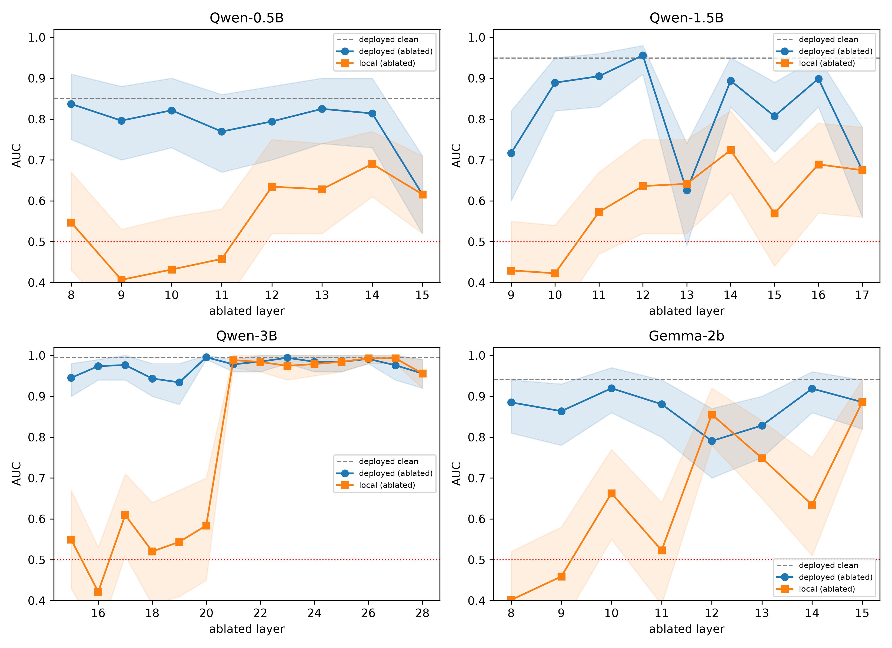
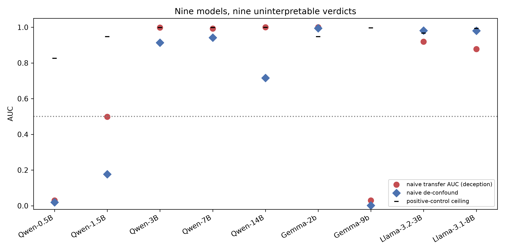

# What Deception Probes Read and How Evaluations of Them Fail

[](https://doi.org/10.5281/zenodo.21632023)

Code, data, and regenerable results for the paper *What Deception Probes Read and How Evaluations of Them Fail* (Andres Garcia, 2026); [read the paper (PDF)](paper/deception-probes-paper.pdf).

Linear probes on LLM activations are the leading proposal for monitoring deceptive generation. This repository contains the full pipeline, data, and regenerable results for a study asking three questions: **what do such probes read, where is that signal computed, and are the standard experiments used to answer those questions sound?** The testbed is instructed lying in a forced-choice Yes/No format, a measurable proxy for deception; every claim is scoped to it.

Short answers, from a pre-specified pipeline on Qwen2.5-0.5B/1.5B/3B and Gemma-2-2b (with a nine-model transfer census):

- **Probes read truth-consistency**, and the computation behind it has **no canonical shape**: deception-specific ablation damage is band-localized at 1.5B (L15-L17), multi-site at Gemma-2b (L9/L11/L13/L14), present locally but absorbed by the deployed readout at 3B (significant local damage at L18 and L20, yet AUC >= 0.93 at the monitor under every single-MLP ablation), and absent at 0.5B.
- **Point interventions misidentify the mechanism in every model.** The strongest disruptor at 1.5B has zero deception-specificity, and 0.5B's "critical" layer is the readout itself. Only per-layer curves with a deception/truth/polarity decomposition adjudicate.
- **The standard steering attack is a threshold shift, not a capability.** Subtracting the probe direction at the readout layer is a translation: every decision score moves by the same constant, so detection collapses while AUC is provably unchanged. We measure that change at 0.000000 in all four models. Injected upstream instead, the attack needs 2.5-7.5x more strength, and a probe refit on the steered activations recovers 0.94-0.99 of clean AUC in three of four models.
- **Instructed-transfer evaluation collapses without controls**: naive transfer AUCs span 0.030-1.000 across nine models (three meet or exceed their own positive-control ceiling); denial bias (all five Qwen models lie only by denying truths) leaves 7/9 models unidentifiable; in the two identifiable models the instruction coefficient is roughly four times the deception effect, whose sign is inconsistent between them.
- Answer polarity survives all 43 ablation conditions (AUC 1.00 throughout), and clean-patching restores 95-98% of what ablation removes in the three models with an identifiable critical layer.

<p align="center">
  
</p>
<p align="center">
  
</p>

## The evaluation protocol

Six controls, each of which reversed a conclusion in this study before we adopted it:

1. Match probe readout position between training and evaluation.
2. Gate transfer tests on behavioral non-degeneracy; exclude, don't average.
3. Require a positive-control ceiling; any transfer number at or above it is likely a confound.
4. Use polarity-controlled regression, never subgroup AUCs.
5. Report causal effects threshold-free (AUC), never as recall on one class.
6. Localize with per-layer curves plus label decomposition, never point interventions at selected components.

## Repository layout

```
data/                              400-statement primary corpus + 100-statement second-source set
scripts/deception_probe.py         Probe training, layer selection, steering, behavioral sweeps
scripts/phase2.py                  Per-layer ablation curves, specificity curves, sufficiency
scripts/phase4_fixed.py            Instructed-transfer battery (behavioral pipeline)
scripts/paraphrase_triangle.py     Format-stability runs (tf / claim paraphrases)
scripts/position_sensitivity.py    Readout-position de-confound
scripts/regress_transfer.py        Polarity-controlled regression, single model
scripts/regress_census.py          Regression and identifiability gate, all nine models
scripts/retrain_under_steering.py  PROTOCOL section 6: refit under upstream steering
scripts/norm_ratio.py              PROTOCOL section 7: residual-norm rescaling test
scripts/corr_upstream.py           Upstream-only correlations for the section 7 test
scripts/deconfound_matched.py      Composition-matched de-confound (exploratory)
scripts/leak_control.py            Instruction-leak census
scripts/denial_bias.py             Denial-bias table
scripts/standardize_diag.py        Preprocessing and position interaction
scripts/check_data_splits.py       Near-duplicate split-integrity audit
scripts/reporting.py               Structured results logging + run manifests
scripts/make_results_md.py         Regenerates MEASURED.md from RESULTS.json
scripts/make_figures.py            Regenerates the combined paper figures
archive/                           Dead threads and pre-fix fixtures, kept for provenance
run_all.sh                         Full release run, in order
paper/                             The paper (PDF) and combined paper figures
results/                           Per-model RESULTS.json, manifests, .npz curve data
figures/                           Per-model figures; figures/paper/ holds the paper figures
MEASURED.md                        Generated source of truth
PROTOCOL.md                        Frozen pipeline, decision rules, pre-registrations
```

## Reproducing

```bash
pip install -r requirements.txt          # exact versions from the release run's manifest
export HF_TOKEN=...                      # Gemma and Llama models are gated on Hugging Face
bash run_all.sh                          # full pipeline (A100-class GPU; ~15-25 GPU-hours)
```

`run_all.sh` regenerates every number and every paper figure, ending with `make_results_md.py` and `make_figures.py`. It includes the PROTOCOL section 6 addendum, which adds roughly one GPU-hour and can be commented out to reproduce only the numbers in the paper as submitted.

Every number in the paper regenerates from `MEASURED.md`; if a number is not there, it was not measured. All published results come from a single clean-room run on one device and precision (A100, fp16). Environment manifests (package versions, model revisions, device) are in `results/*/MANIFEST*.json`; the release run wrote one per model rather than one per analysis, and the scope of what that does and does not establish is stated in [PROTOCOL.md](PROTOCOL.md). Expect decimal-level drift on other hardware; verdicts should not change. If one does, we would genuinely like to hear about it, as the paper's evaluation section is about exactly this phenomenon.

Total compute: the release run reproduces for approximately $20-30 in rented GPU time; total project compute, including development and reruns, was under $100.

The complete results tree, including the large activation caches excluded from this repository, is archived at [doi:10.5281/zenodo.21632102](https://doi.org/10.5281/zenodo.21632102).

## A note on process

This project's findings were revised six times by its own controls before publication: a recall-based metric inverted the strongest necessity effect, an accuracy-based metric manufactured a critical layer at 3B, a restoration formula with a missing condition reversed the sufficiency verdict, a degenerate control looked like a discovery, a clean-room rerun flipped a regression coefficient's sign, and a control selected under one metric failed under another. Appendix F of the paper documents all six. The released pipeline is the version that survives them.

Sections 6 and 7 of [PROTOCOL.md](PROTOCOL.md) are pre-registered addenda committed before their data was collected, and their recorded outcomes include imperfections in the registrations themselves (an unspecified estimator, an imprecise readout scope), disclosed rather than resolved after the fact. Section 7 tested and retired a mechanism this project had itself proposed: the accuracy-versus-AUC de-calibration under ablation is not a residual-norm rescaling artifact at the cell where it was observed.

## Citation

See [`CITATION.cff`](CITATION.cff). BibTeX:

```bibtex
@misc{garcia2026deceptionprobes,
  title  = {What Deception Probes Read and How Evaluations of Them Fail},
  author = {Garcia, Andres},
  year   = {2026},
  url    = {https://github.com/Andresg324/truth-probes},
}
```

## Disclosure

The primary 400-statement corpus was drafted with LLM assistance (Claude Opus 4.8, May 2026) and reviewed by the author for factual accuracy and length. The 100-statement second-source transfer set was authored by a non-author with ChatGPT assistance (default model, June 2026), delivered as a document and converted to JSON by the author; it therefore tests generalization across author, model family, and collection pipeline, not AI-versus-human provenance. Manuscript preparation used AI writing assistance; all experimental design decisions, code review, and claims are the author's. See LICENSE for terms.